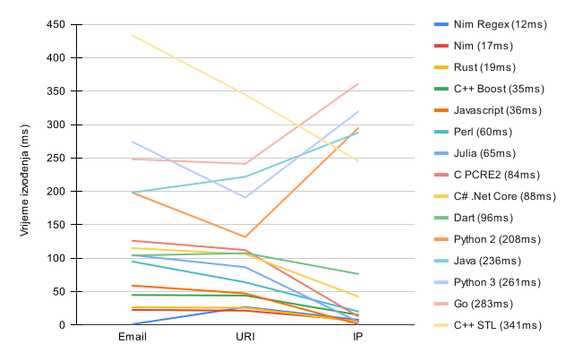

<!-- _class: lead -->

# Regularni izrazi u računalstvu
## Tin Švagelj

---
<!-- paginate: true -->

# O meni
<!-- _class: author-page -->


## Tin Švagelj

Portfolio: [caellian.me](https://caellian.me)
Github: [github.com/Caellian](https://github.com/Caellian)

<hr/>

Preddiplomski studij informatike
3. godina studija

---
# Što je regex?

---
# Što je regex?
<!-- _class: space-even -->

Primjer regex izraza:
```regex
\{\{(.+)\}\}
```

Primjer primjene:
```html
<ul class="people_list">
  {{#each people}}
    <li>{{this}}</li>
  {{/each}}
</ul>
```

---

# Zašto regex?

- Olakšava rad sa nizovima znakova/simbola.
	- Provjera ispravnosti unesenih podataka.
	- Manipulacija tekstualnog sadržaja.
		- Masovno upravljanje ponavljajućim obrascima podataka.
	- Pretraživanje ogromnih datoteka.


---

# Zašto regex?

- Uklanja potencijalne pogreške manualnih implementacija.
  - Delegacija ogrovornosti prilikom razvoja. 
  - *Sažetiji* je.

---
# Zašto NE regex?
<!-- _class: space-even -->

S obzirom na **uvijete primjene**, može biti *spor* i/ili *velik*.

S obzirom na **svrhu primjene**, može biti pre *napredan* ili *ograničen*.

---

# Regex je spor
<!-- _class: align-center -->

Koji regex?

---
# Regex je spor
<!-- _class: image-fill -->
<!-- _footer: Izvor: https://github.com/mariomka/regex-benchmark -->



<!-- Najsporija je C# Mono implementacija -->

---
# Regex je velik

- Nim, C++ STL, jezici visoke razine
  - dio standardne biblioteke/izvršnog okruženja
- Rust `regex` v1.7.3 je velik **240kB**
- C++
  - `Boost.Regex` v1.81 je velik **342kB**
  - `Re2` v10.0 je velik **369kB**
- C
  - `PCRE` v8.45 je velik **493kB**
  - `PCRE2` v10.42 je velik **547kB**

---
# Regex je velik

<!-- _class: align-center -->

C++20/17: [CTRE v3](https://github.com/hanickadot/compile-time-regular-expressions) — Hana Dusíková

---
# Regex je pre napredan/ograničen

- Kompliciranje jednostavnih rješenja.
- Primjena neispravnih alata.
- Strah od veličine distribuirane aplikacije.

---
# Primjene Regexa

---

# U kȏdu
```python
x = re.search("\{\{(.+)\}\}", txt)
```
---
# U editorima

---
# Čišćenje podataka

```
$.*(-|/|'|&).*\n
.*\d.*\n
^(.)\1+\n
^(.)\1+\w\n
^[A-Z]+\n
```
---
# Osnove implementacije
