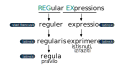

<!-- _class: lead -->

# Pravilni izrazi u računalstvu
## Tin Švagelj

---

# O meni
<!-- _class: author-page -->


## Tin Švagelj

Portfolio: [caellian.me](https://caellian.me)
Github: [github.com/Caellian](https://github.com/Caellian)

<hr/>

Preddiplomski studij informatike
3. godina studija

---
# Što je regex?



---
# Što je regex?
<!-- _class: space-even -->

Primjer regex izraza:
```regex
\{\{(.+)\}\}
```

Primjer primjene:
```html
<ul class="people_list">
  {{#each people}}
    <li>{{this}}</li>
  {{/each}}
</ul>
```

---
<!-- _class: part -->

# Trebam li regex?

---

# Zašto regex?

- Olakšava rad sa nizovima znakova/simbola.
	- Provjera ispravnosti unesenih podataka.
	- Manipulacija tekstualnog sadržaja.
		- Masovno upravljanje ponavljajućim obrascima podataka.
	- Pretraživanje ogromnih datoteka.


---

# Zašto regex?

- Uklanja potencijalne pogreške manualnih implementacija.
  - Delegacija odgovornosti prilikom razvoja. 
  - *Sažetiji* je.

---
# Zašto NE regex?
<!-- _class: space-even -->

S obzirom na **uvijete primjene**, može biti *spor* i/ili *velik*.

S obzirom na **svrhu primjene**, može biti pre *napredan* ili *ograničen*.

---

# Regex je spor
<!-- _class: align-center -->

Koji regex?

---
# Regex je spor
<!-- _footer: Izvor: https://github.com/mariomka/regex-benchmark -->


<!--
- Najsporija je C# Mono implementacija koja nije uključena u graf jer bi stisnula sve ostale u doljnjih 20% grafa.
- 5.5x sporiji od C++ STL implementacije
- 100x sporiji od Rust implementacije
- Unity Mono
-->

---
# Regex je pre napredan/ograničen

- Kompliciranje jednostavnih rješenja.
- Primjena (ne)ispravnih alata.
- Strah od veličine distribuirane aplikacije.

<!--
1. Ima slučajeva gdje nema smisla koristiti regex.
- Primjer s posla: provjera unosa, sadržavanje @ razlikuje email i UUID
2. U određenim slučajevima nam je potrebno više povratnih podataka nego što nam regex engine tj. biblioteke vrate
- Primjer: tokenizer za programski jezik
3. Odabir ispravnog alata ne smije triggerat strahove oko 
-->

---
# Regex je velik

- Nim, C++ STL, jezici visoke razine
  - dio standardne biblioteke/izvršnog okruženja
- Rust `regex` v1.7.3 je velik **240 kB**
- C++
  - `Boost.Regex` v1.81 je velik **342 kB**
  - `Re2` v10.0 je velik **369 kB**
- C
  - `PCRE` v8.45 je velik **493 kB**
  - `PCRE2` v10.42 je velik **547 kB**

---
# Regex je velik

<!-- _class: align-center -->

C++20/17: [CTRE v3](https://github.com/hanickadot/compile-time-regular-expressions) — Hana Dusíková

---
<!-- _class: part -->

# Primjene Regexa

---

# U kȏdu
Python:
```python
result = re.search("\\{\\{(.+)\\}\\}", txt)
```
C++:
```c++
boost::regex expression("\\{\\{(.+)\\}\\}");
```
Rust:
```rust
let re = regex!("\\{\\{(.+)\\}\\}");
```

\+ odgovarajuće funkcije za iteraciju kroz uhvaćene grupe.

---
# U editorima

<!-- TODO: Slika primjene u editoru -->
<!--
- Refaktoriranje
- Primjer s posla: Umetanje logging izraza u svakom pozivu useEffect
- Rust: Umetanje argumenta poziva funkcije deklarirane u traitovima 
-->

---
# Čišćenje podataka
<!-- _class: use-example -->

```sh
cat "message.txt"\
  | sed -E "s/\xC2\xA0/ /g"\
  | sed -E "s/$ +//g"\
  | sed -E "s/\n\s+\n/\n\n/g"\
  | sed -E "s/\n{3,}/\n\n/g"\
  | sed -E "s/ {2,}/ /g"\
  | sed -E "s/,{2,}/,/g"\
  | sed -E "s/\s+(\.|,)/\1/g"\
  | sed -E "s/(\.|,)(\w)/\1 \2/g"
```

# Ulazni podaci

```
Rekli su mi da će party biti danas .Tako
da se trebamo  dogovoriti čim prije,,
⌴⌴
⌴

neki su već krenuli.
```

# Rezultat

```
Rekli su mi da će party biti danas. Tako
da se trebamo dogovoriti čim prije,

neki su već krenuli.
```

---
<!-- _class: part -->

# Kako regex radi

---

# Kako regex radi

```
^[A-Za-z]+
```

Pokušaj pronaći:
- samo na početku unosa,<span class="code float-right">^</span>
- jedan ili više,<span class="code float-right">+</span>
  - bilo koji znak iz grupe:<span class="code float-right">[]</span>
    - veći ili jednak 'A', i manji ili jednak 'Z'<span class="code float-right">A-Z</span>
    - veći ili jednak 'a', i manji ili jednak 'z'<span class="code float-right">a-z</span>

---

# Kako regex radi

Istoznačan kod u C99:
```c
bool match_test(const char *input, size_t length) {
  char *c = input;
  // size_t length = strlen();

  if (length == 0) return false;

  while(c < input + length) {
    if ((*c>='A' && *c<='Z') || (*c>='a' && *c<='z')) {
      continue;
    } else {
      return false;
    }
  }
  return c == input + length;
}
```

